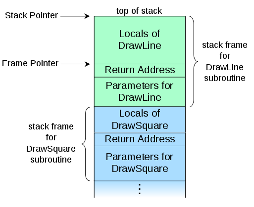
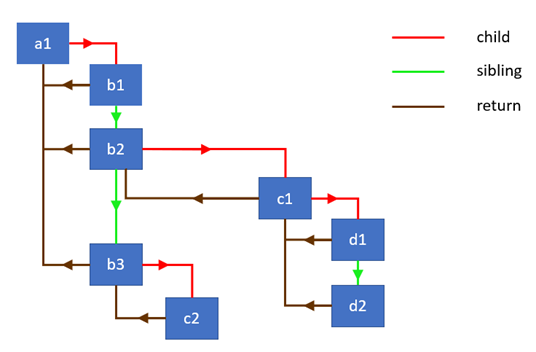

[이글](https://medium.com/react-in-depth/the-how-and-why-on-reacts-usage-of-linked-list-in-fiber-67f1014d0eb7)을 번역 및 분석 한 글입니다. 잘못된 번역 및 생략된 번역이 있을 수 있습니다.

## The how and why on React’s usage of linked list in Fiber to walk the component’s tree

Fiber 의 아키텍처는 2 가지의 주요한 단계이 있다. reconcilation/render 와 commit 이다.
소스코드 안에 있는 reconciliation 단계를 "render pahse" 라고 한다.

이 단계에는 React 가 컴포넌트 트리를 탐색하면서 다음과 같은 일을 한다.

- updates state and props, (state 와 props를 업데이트)
- calls lifecycle hooks, (라이프 사이클 훅 호출)
- retrieves the children from the component, (컴포넌트 자식을 탐색한다.)
- compares them to the previous children, (이전 자식들과 비교한다.)
- and figures out the DOM updates that need to be performed. (그리고 DOM update가 필요한지 확인한다.)

**이 모든 행동들을 Fiber 안에서 작업이라고 합니다.**

수행해야 할 작업의 타입은 React Element 에 따라 다릅니다. 예를들면 클래스 컴포넌트는 인스턴스화 해야하지만 함수 컴포넌트는 그렇지 않습니다.

흥미가 있다면 [이글](https://github.com/facebook/react/blob/340bfd9393e8173adca5380e6587e1ea1a23cefa/packages/shared/ReactWorkTags.js#L29-L28)를 읽어봐라 여기서 Fiber 의 작업 타겟의 타입들을 볼수 있다.

```javascript
export type WorkTag = 0 | 1 | 2 //....

export const FunctionalComponent = 0
export const ClassComponent = 2
export const HostRoot = 5 // Root of a host tree. Could be nested inside another node.
```

> UI를 다룰 때 문제는 한 번에 너무 많은 작업이 실행되면 애니메이션이 프레임을 떨어 뜨릴 수 있다는 것입니다.

리액트는 컴포넌트를 동기적으로 순회하면서 각 컴포넌트에서 작업을 처리한다고 했을때 어플리케이션 로직은 16ms 초 이상이 될 수 있다. 그로 인해 프레임이 망가져 시각적 효과가 끊길수 있다.

그래서 여기선 `requestIdleCallback` 이라는 글로벌 함수를 사용할 것이다. 브라우저가 idle 기간에 함수를 호출하게끔 큐를 사용하는 함수이다.

```javascript
requestIdleCallback(deadline => {
  console.log(deadline.timeRemaining(), deadline.didTimeout)
})
```

이 코드를 실행 했을 때, 크롬 로그에서 `49.9 false` 가 나왔다면 그것은 나에게 이렇게 말하는 것과 같다. 내가 필요한 작업이 무엇이든 할수 있는 `49.9ms` 가 있고 나는 할당 된 시간을 모두 다 사용하지 않았다.

반대는 `deadline.didTimeout` 이 true 일 것이다. `timeRemaining`는 브라우저가 어떤 작업을 수행하자마자 바뀔 수 있으므로 항상 확인해야합니다.

만약 우리가 모든 컴포넌트의 수행을 `performWork` 함수에 넣고 작업 스케쥴을 위해 `requestIdleCallback` 을 사용할 수 있다면 다음과 같은 코드가 될것이다.

```javascript
requestIdleCallback(deadline => {
  // while we have time, perform work for a part of the components tree
  while (
    (deadline.timeRemaining() > 0 || deadline.didTimeout) &&
    nextComponent
  ) {
    nextComponent = performWork(nextComponent)
  }
})
```

한 컴포넌트 작업을 수행한 후 다음 컴포넌트 수행을 위한 참조값을 리턴할것이다.
우리는 모든 컴포넌트 트리의 절차를 동기적으로 수행할 수 없다. 이전 `reconciliation` 알고리즘 수행 처럼 그리고 그것의 문제를 앤드류는 이렇게 말하고 있습니다.

> 이러한 API 를 사용하려면 우리는 증분 단위로 렌더링 작업을 나눠야 한다.

그래서 이 문제를 해결하기 위해 React 는 **빌트인 스택에 의존하는 동기식 재귀 모델에서 연결된 리스트와 포인터가있는 비동기 모델로 트리를 이동하는 알고리즘**을 다시 구현해야했습니다.

> 만약 빌트인된 콜 스택에 의존하게 된다면 그것은 스택이 비어질때까지 계속 실행해야 할 것입니다. 우리가 원하는대로 호출 스택을 중단하고 수동으로 스택 프레임을 조작 할 수 있다면 좋지 않을까요? 그것은 React Fiber 의 목적입니다. fiber 는 React 구성 요소에 특화된 스택의 재 구현입니다. 단일 fiber 가상 스택 프레임으로 생각할 수 있습니다.

### A word about the stack

호출 스택 개념에 익숙하다고 가정합니다. 이것은 중단 점에서 코드를 일시 중지하면 브라우저의 디버깅 도구에서 볼 수 있습니다. 다음은 Wikipedia 의 관련 인용문과 다이어그램입니다.

> In computer science, a call stack is a stack data structure that stores information about the active subroutines of a computer program… the main reason for having call stack is to keep track of the point to which each active subroutine should return control when it finishes executing… A call stack is composed of stack frames… Each stack frame corresponds to a call to a subroutine which has not yet terminated with a return. For example, if a subroutine named DrawLine is currently running, having been called by a subroutine DrawSquare, the top part of the call stack might be laid out like in the adjacent picture.



### Why is the stack relevant to React?

스택이 React 와 관련이있는 이유는 무엇입니까?

우리는 기사의 첫파트에 정의했었다. 리액트는 컴포넌트 트리를 reconciliation/render 단계동안 순회하고 몇몇 작업들을 수행한다. 이전에 동기적인 재귀 모델로 동작했던 reconciler 사용은 트리를 순회하기 위해서 빌트인된 stack 에 의존했었다.

이것에 대해서 생각해보자. 각 재귀 호출이 frame 을 스택에 쌓게 되고 그것이 동기으로 동작한다는 것이다.

다음과 같은 트리 구조가 있다고 가정해보자.


각각은 render 함수가 있는 객체라고 하자. 다음과 같은 컴포넌트 인스턴스라고 생각 될 것이다.

```javascript
const a1 = { name: 'a1' }
const b1 = { name: 'b1' }
const b2 = { name: 'b2' }
const b3 = { name: 'b3' }
const c1 = { name: 'c1' }
const c2 = { name: 'c2' }
const d1 = { name: 'd1' }
const d2 = { name: 'd2' }

a1.render = () => [b1, b2, b3]
b1.render = () => []
b2.render = () => [c1]
b3.render = () => [c2]
c1.render = () => [d1, d2]
c2.render = () => []
d1.render = () => []
d2.render = () => []
```

리액트는 이 트리 순회가 필요하고 각 컴포넌트마다 작업을 수행해야 한다. 간단하게 말해서 할 일은 현재 구성 요소의 이름을 로그하고 그 하위를 검색하는 것입니다.

### Recursive traversal

재귀를 사용하는 방법을 보자.
트리를 반복하는 주요 기능을 아래 구현에서 `walk` 라고합니다.

```javascript
walk(a1)

function walk(instance) {
  doWork(instance)
  const children = instance.render()
  children.forEach(walk)
}

function doWork(o) {
  console.log(o.name)
}
```

그럼 다음과 같은 output 이 나올 것이다.

```
a1, b1, b2, c1, d1, d2, b3, c2
```

만약 이런 재귀 방식이 혼동 된다면 [이 글](https://codeburst.io/learn-and-understand-recursion-in-javascript-b588218e87ea)을 참고하자.

재귀적인 접근은 직관적이다 그리고 트리를 탐색하기에 적합하다. 하지만 그것은 제한적이다. 가장 큰 문제는 이 작업을 점진적인 단위로 나눌수가 없다는 것이다. 우리는 이 작업을 특별한 컴포넌트 지점에서 잠시 멈췄다가 이후에 다시 재개할 수가 없다. 이 접근은 리액트가 모든 컴포넌트 처리가 될때까지 이어지고 나서 스택이 비워진다.

**그래서 어떻게 이런 재귀 없이 리액트는 트리 순환을 실행할수 있을까? 그것은 단일 링크드 리스트 트리 탐색 알고리즘을 사용합니다. 그것은 순회를 멈추고 스택의 증가를 멈추가 할 수 있습니다.**

### Linked list traversal

운좋게 여기서 알고리즘의 골자를 찾을 수 있었습니다. [https://github.com/facebook/react/issues/7942#issue-182373497](https://github.com/facebook/react/issues/7942#issue-182373497)

이 알고리즘을 수행하려면 우리는 3 가지 필드를 가진 데이터 구조가 필요합니다.

- child — reference to the first child
- sibling — reference to the first sibling
- return — reference to the parent

React 의 새로운 reconciliation 알고리즘과 관련하여 이 필드가있는 데이터 구조를 Fiber 라고합니다. Fiber는 queue에 작업을 구성하고 있는 React Element를 대표하는 것입니다.

다음 다이어그램은 링크드 리스트를 통해 연결된 개체의 계층 구조와 개체 간의 연결 유형을 보여줍니다.



그럼 첫번째로 우리의 커스텀 노드 생성자를 정의해 봅시다.

```javascript
class Node {
  constructor(instance) {
    this.instance = instance
    this.child = null // 가장 첫번째 자식만 가지고 있는다.
    this.sibling = null // 두번째 자식을 접근하려고 하면 자식의 sibling으로 접근해야 한다.
    this.return = null // 부모를 참조해둔다.
  }
}
```

그리곤 노드들의 배열을 받아서 그것들을 함께 엮는 함수를 봅시다.
우리는 함수를 사용해서 `render` 메서드에서 반환된 children 을 연결할 것입니다.

```javascript
// 부모에다가 children[] 을 연결한다.
function link(parent, elements) {
  if (elements === null) elements = []

  // node 하나를 리턴 받을 건데
  // 이 node에는 sibling으로 쭈욱 연결된 리스트 들이 있다.
  // 단일로 연결한다.
  // 부모 - 자식 - 자식형제 - 자식형제 - 자식형제
  parent.child = elements.reduceRight((previous, current) => {
    const node = new Node(current)
    node.return = parent
    node.sibling = previous
    return node
  }, null)

  return parent.child
}
```

이 함수는 노드 배열에서 맨 마지막걸 시작으로 순회하고, 그것들을 단일 링크드 리스트로 연결한다.
여기서 리스트의 가장 첫번째 sibling 이 리턴된다.

여기 데모를 보자.

```javascript
const children = [{ name: 'b1' }, { name: 'b2' }]
const parent = new Node({ name: 'a1' })
const child = link(parent, children)

// the following two statements are true
console.log(child.instance.name === 'b1')
console.log(child.sibling.instance === children[1])
```

또한 노드에 대한 작업을 수행하는 도우미 함수를 구현합니다. 여기서는 component의 이름을 기록합니다. 그러나 그 외에도 구성 요소의 하위 항목을 검색하고 함께 연결합니다.

```javascript
function doWork(node) {
  console.log(node.instance.name)
  const children = node.instance.render() // children 배열
  return link(node, children) // children 배열을 선형적으로 부모 노드에 연결 후 첫번째 자식 반환
}
```

우리는 메인 탐색 알고리즘을 실행할 준비가 되었습니다. 부모를 처음으로 깊이 우선 구현입니다.

깊이 우선 구현이란 먼저 아래 방향(깊이 우선)으로 child 를 활성화 노드를 시켜주면서 doWork() 로 계속 child 를 링크드 리스트로 연결한 후에 child 가 없으면 그때 sibling 을 활성화 노드를 시켜주고 다시 doWork()로 계속 child 를 링크드 리스트로 연결 더이상의 sibling 이 없다면 부모로 올라가 부모의 sibling 을 찾는다.

```javascript
function walk(o) {
  let root = o
  let current = o

  while (true) {
    // perform work for a node, retrieve & link the children
    // node에 대한 작업 수행, children을 탐색 및 연결한다.
    // current의 render 작업 후 current의 children을 선형적으로 current에 연결
    let child = doWork(current) // current의 첫번째 자식을 반환

    // if there's a child, set it as the current active node
    // 만약 child 가 있으면 그것을 현재 활성 node로 설정한다.
    if (child) {
      current = child
      continue // 다시 while 수행
    }

    // if we've returned to the top, exit the function
    // 만약 여기서 child가 없고 현재값이 top이면 함수를 종료한다.
    if (current === root) {
      return
    }

    // keep going up until we find the sibling
    // sibling을 찾을때까지 수행한다.
    while (!current.sibling) {
      // 형제가 없다면
      // if we've returned to the top, exit the function
      // 만약 return이 top이면 종료한다.
      if (!current.return || current.return === root) {
        return
      }

      // set the parent as the current active node
      // 부모를 현재 활성 노드로 셋팅한다.
      current = current.return
    }

    // if found, set the sibling as the current active node
    // sibling을 발견하면 sibling을 현재 활성 노드로 셋팅한다.
    current = current.sibling
  }
}
```

이 구현이 이해하기가 특히 어렵지는 않지만, 그것을 구현하기 위해서는 약간의 노력이 필요할 수 있습니다. 여기서 확인해보자. [https://stackblitz.com/edit/js-tle1wr](https://stackblitz.com/edit/js-tle1wr)

아이디어는 현재 노드에 대한 참조를 유지하고 트리의 내림차순으로 분기 끝에 도달 할 때까지 다시 할당한다는 것입니다. 그런 다음 리턴 포인터를 사용하여 공통 부모로 리턴합니다.

만약 이 실행을 콜스택으로 체크한다면 다음과 같을 것입니다.


보시다시피 스택은 트리를 탐색하면서 증가하지 않습니다. 그러나 디버거를 `doWork` 함수에 넣고 노드 이름을 기록하면 다음과 같이 표시됩니다.


**브라우저의 콜 스택과 같습니다.** 따라서이 알고리즘을 사용하면 브라우저의 호출 스택 구현을 자체 구현으로 효과적으로 대체 할 수 있습니다. 이것이 앤드류가 여기서 묘사 한 것입니다 :

> Fiber 는 React 구성 요소에 특화된 스택의 재 구현입니다. 단일 fiber 를 가상 스택 프레임으로 생각할 수 있습니다.

이제 최상위 프레임 역할을하는 노드에 대한 참조를 유지함으로써 스택을 제어하기 때문에

```javascript
function walk(o) {
    let root = o;
    let current = o;

    while (true) {
            ...

            current = child;
            ...

            current = current.return;
            ...

            current = current.sibling;
    }
}
```

우리는 어떤 시간에도 탐색을 멈췄다가 다시 재개 할 수 있습니다. 이것이 바로 새로운 `requestIdleCallback` API 를 사용하기 위해 달성하고 싶은 조건입니다.

### Work loop in React

실제 리액트 안에서의 실행 코드이다. [여기 코드](https://github.com/facebook/react/blob/95a313ec0b957f71798a69d8e83408f40e76765b/packages/react-reconciler/src/ReactFiberScheduler.js#L1118)

```javascript
function workLoop(isYieldy) {
  if (!isYieldy) {
    // Flush work without yielding
    while (nextUnitOfWork !== null) {
      nextUnitOfWork = performUnitOfWork(nextUnitOfWork)
    }
  } else {
    // Flush asynchronous work until the deadline runs out of time.
    while (nextUnitOfWork !== null && !shouldYield()) {
      nextUnitOfWork = performUnitOfWork(nextUnitOfWork)
    }
  }
}
```

보시다시피, 위의 알고리즘과 잘 일치합니다. 상단 프레임으로 작동하는 `nextUnitOfWork` 변수에 현재 fiber 노드에 대한 참조를 유지합니다.

이 알고리즘은 컴포넌트 트리를 **동기적**으로 순회하고 트리 (`nextUnitOfWork`)안에 각 fiber 노드에 대한 작업을 수행 할 수 있습니다. 이것은 대게 UI 이벤트 (클릭, 입력 등)로 인한 소위 대화 형 업데이트의 경우가 일반적입니다.

또는 fiber 노드 작업을 수행 한 후 남은 시간이 있는지 여부를 **비동기식**으로 확인하여 구성 요소 트리를 탐색 할 수 있습니다. 함수 `shouldYield` 는 [`deadlineDidExpire`](https://github.com/facebook/react/blob/95a313ec0b957f71798a69d8e83408f40e76765b/packages/react-reconciler/src/ReactFiberScheduler.js#L1806) 와 React 가 fiber 노드에 대해 작업을 수행함에 따라 지속적으로 업데이트되는 [`deadline`](https://github.com/facebook/react/blob/95a313ec0b957f71798a69d8e83408f40e76765b/packages/react-reconciler/src/ReactFiberScheduler.js#L1809) 변수를 기반으로 결과를 반환합니다.

다음 시리즈는 `performUnitOfWork` 함수에 대한 심도있는 설명 글입니다.
